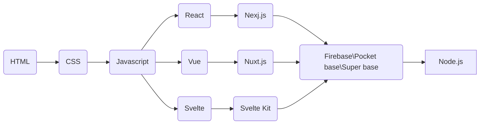

# 路线

## Web dev

基础-->交互语言 --> 框架 --> 元框架 --> 后端 --> 无服务平台

```mermaid
graph LR
A(HTML) --> B(CSS) -->C(Javascript)
C --> D(React) --> G(Nexj.js)
C --> E(Vue) --> H(Nuxt.js)
C--> F(Svelte) --> I(Svelte Kit)
G --> J(Firebase\Pocket base\Super base)
H --> J
I --> J
J --> Node.js
```

Angular Vite tailwindcss

java，Spring Boot，Ruby on Rails或Laravel 

PHP